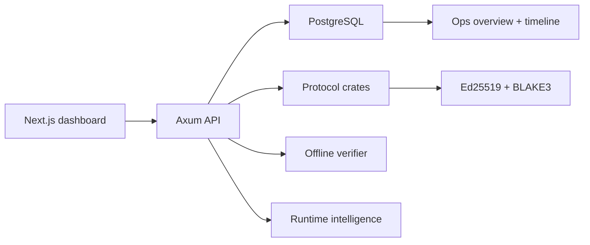

# PACTARA Architecture

PACTARA is a Rust and Next.js monorepo. The backend owns protocol state, cryptographic verification, policy, ledger, agents, and world-runtime orchestration. The frontend is a mission control dashboard over the public API.

## Repository Map

- `crates/pactara-core`: shared protocol types, request/response models, and runtime objects.
- `crates/pactara-crypto`: Ed25519 signing, verification, and BLAKE3 hashing helpers.
- `crates/pactara-auth`: challenge and signed-request verification primitives.
- `crates/pactara-domain`: civilization domain templates and domain-to-PACT mapping.
- `crates/pactara-ledger`: sandbox ledger constants and ledger behavior.
- `crates/pactara-agent`: mandate and policy helpers for supervised agents.
- `crates/pactara-intelligence`: deterministic intelligence helpers for runtime signals and decisions.
- `crates/pactara-db`: PostgreSQL access layer, migrations, counters, and runtime projections.
- `crates/pactara-verifier`: portable offline bundle verifier.
- `crates/pactara-api`: Axum HTTP API, validation, auth gates, and orchestration handlers.
- `apps/web`: Next.js dashboard for PACTs, verification, ops, workflows, policy, scenarios, crews, and timelines.
- `migrations`: SQLx migrations applied automatically by the API at startup.
- `infra/docker`: backend Dockerfile used by Docker Compose.

## Runtime Shape

## Protocol Flow

1. Generate Ed25519 key material in the browser and create an identity with the public key.
2. Create a draft PACT from actor, intent, object, target, terms, consent, and proof.
3. Compute the canonical signing payload and BLAKE3 hash.
4. Sign the payload with Ed25519 on the client and submit only the public key, hash, and signature.
5. Verify hash, signature, expiry, and revocation state.
6. Export a bundle for portable or offline verification.
7. Attach workflows, policy decisions, audit events, ledger movements, scenarios, commands, and agent activity around the same protocol objects.

## Source Of Truth

PostgreSQL is the source of truth for runtime state. The trust graph, ops overview, runtime timeline, notifications, and dashboard surfaces are projections over persisted protocol tables.

The `pactara-verifier` crate is independent from PostgreSQL. It verifies exported bundles from embedded contents so external clients can validate a PACT without trusting the API response.

## Security Notes

Production mode keeps private keys out of PostgreSQL and out of the API. Server-side developer custody is available only when `PACTARA_DEV_CUSTODY_ENABLED=true`; production should keep it disabled and rely on client-side, hardware-backed, or threshold-managed signing.

When `PACTARA_AUTH_REQUIRED=true`, protected mutation endpoints require a valid `x-pactara-session` token. Spoofable auth headers are not trusted. CORS is controlled by `PACTARA_CORS_ALLOW_ORIGINS`.
